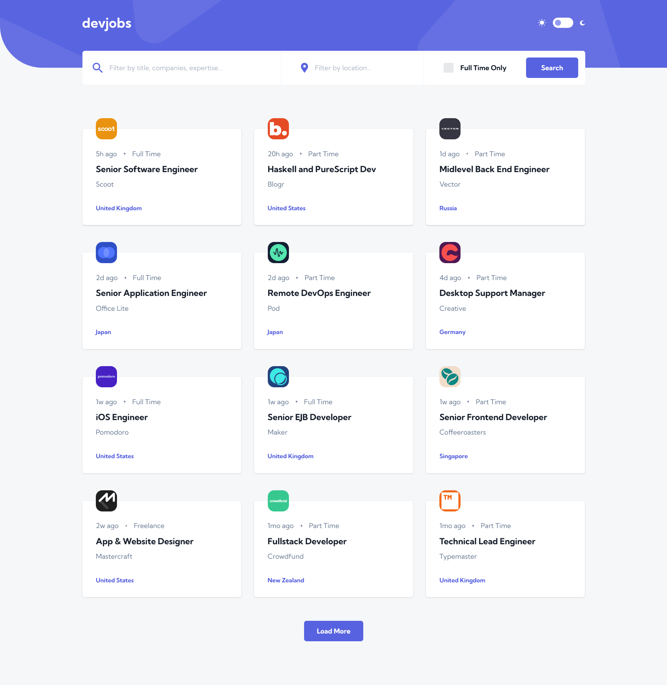

# Frontend Mentor - Devjobs web app solution

This is a solution to the [Devjobs web app challenge on Frontend Mentor](https://www.frontendmentor.io/challenges/devjobs-web-app-HuvC_LP4l). Frontend Mentor challenges help you improve your coding skills by building realistic projects.

My personal challenge was to implement a given design using [Chakra UI library](https://chakra-ui.com/).

## Overview

### The challenge

Users should be able to:

- View the optimal layout for each page depending on their device's screen size
- See hover states for all interactive elements throughout the site
- Be able to filter jobs on the index page by title, location, and whether a job is for a full-time position
- Be able to click a job from the index page so that they can read more information and apply for the job
- **Bonus**: Have the correct color scheme chosen for them based on their computer preferences. _Hint_: Research `prefers-color-scheme` in CSS.

### Screenshot

### Links

- Solution URL: [https://github.com/nadlgit/fmchallenge-devjobs](https://github.com/nadlgit/fmchallenge-devjobs)
- Live Site URL: [https://nadlgit.github.io/fmchallenge-devjobs](https://nadlgit.github.io/fmchallenge-devjobs)

## Built with

- [React](https://reactjs.org/)
- [Typescript](https://www.typescriptlang.org/)
- [Chakra UI](https://chakra-ui.com/)
- [React Router](https://reactrouter.com/)
- [Vite](https://vitejs.dev/)
- Tested with [Vitest](https://vitest.dev/), [Testing Library](https://testing-library.com/) and [jest-extended](https://jest-extended.jestcommunity.dev/)
